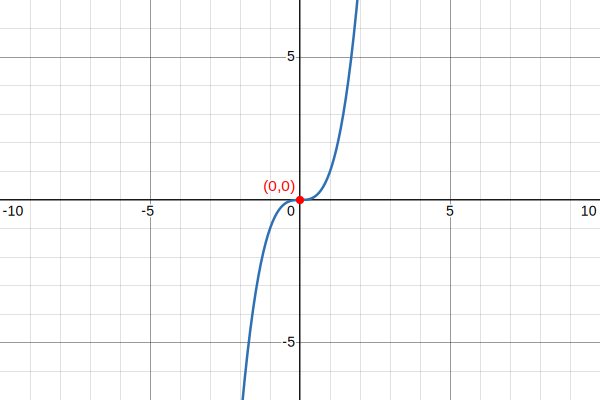
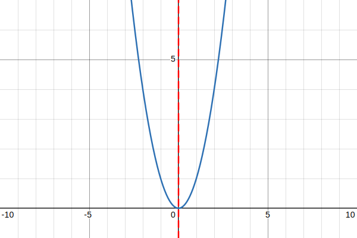

### An odd function

An odd function is a function $f(x)$ where $f(-x) = -f(x)$ for all $x$ in its [[M 1013 Domain of a function|domain]], which must be symmetric about the origin.
#### Example
##### $f(x) = x³$
## 
### An even function

An even function is a function $f(x)$ for which $f(-x) = f(x)$ for all $x$ in its [[M 1013 Domain of a function|domain]], meaning its graph is symmetric about the y-axis.
#### Example: 
##### $y = x^2$
